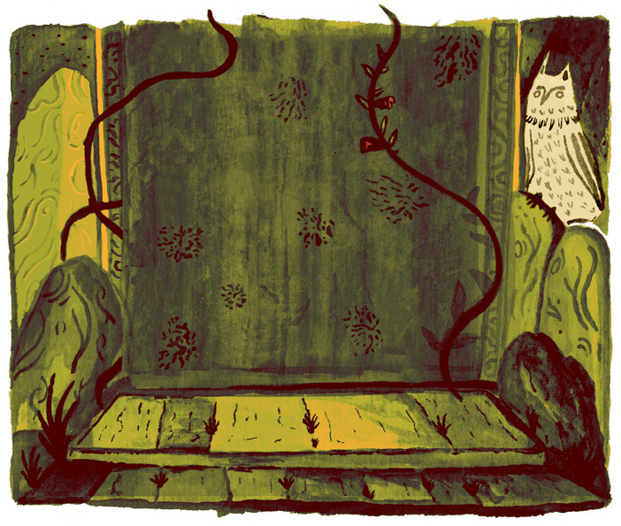
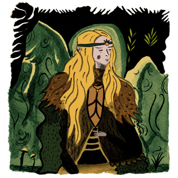
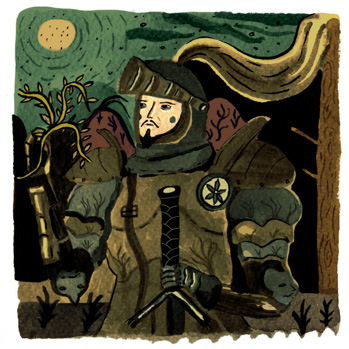
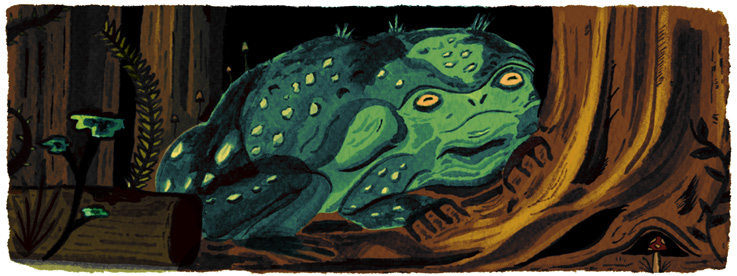
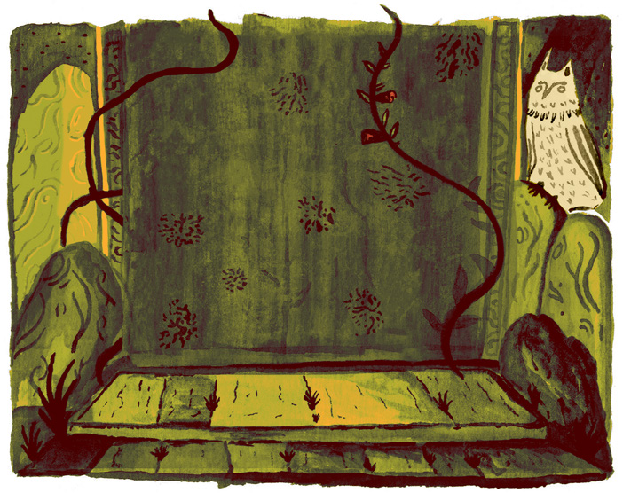
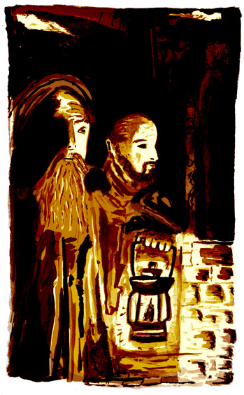
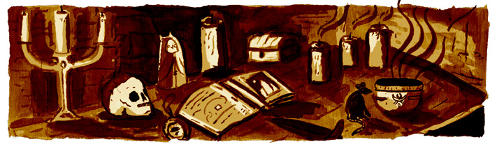

# La fille de l'Hiver

## À propos de cette aventure

*La fille de l'Hiver* est une courte aventure qui se déroule dans le **Dolmenwood**, le scénario de campagne campagne publié par **Necrotic Gnome**. L'aventure tourne autour de l'amour interdit entre un chevalier mortel et une princesse fée, dans des temps anciens où les deux races se faisaient la guerre. La tombe du chevalier est scellée depuis des siècles.
Elle cache de nombreux secrets et (bien sûr) trésors.

### Les essentiels de Old-School

L'arbitre a besoin d'une copie de **Old-School Essentials** pour mener cette aventure. Les règles Classic Fantasy et Advanced Fantasy fonctionnent aussi bien. Alternativement, le jeu classique Basic/Expert ou tout autre règles dérivées peuvent être utilisées.

### Niveaux de personnage 1-3

Cette aventure convient aux PJ de niveaux 1 à 3. Notez que, comme il s'agit d'une aventure dans le style de la vieille école, toutes les rencontres ne sont pas destinées à être équilibrées en fonction des capacités des PJ. L'utilisation judicieuse de la furtivité, des pourparlers, et de la ruse sont à encourager, au lieu de se précipiter aveuglément au combat.
La discrétion est toujours la meilleure forme de courage.

### Nouveau à Dolmenwood ?

Les groupes qui sont nouveaux dans le cadre de Dolmenwood sont encouragés à consulter le PDF Bienvenue à Dolmenwood pour une
une introduction rapide, sans spoiler, à l'environnement, y compris une petite gazette, et la carte de Dolmenwood pour l'Arbitre. Les deux sont
disponibles gratuitement sur **necroticgnome.com**.

#### Utiliser cette aventure dans Dolmenwood

Les arbitres qui dirigent des jeux se déroulant dans Dolmenwood peuvent placer cette aventure dans n'importe quel hexagone en dehors de l'Anneau de Sorcellerie de Chell. 
Les événements de l'aventure ne se rapportent pas à un endroit spécifique de la forêt.
Les joueurs ayant un penchant pour l'investigation peuvent découvrir certains secrets relatifs à la guerre entre fées et mortels qui a ravagé Dolmenwood il y a environ neuf siècles.
L'arbitre pourrait utiliser ces accroches pour connecter cette aventure dans un arc de campagne plus large qui tourne autour des tentatives du seigneur des fées banni, le Prince du Froid, de revenir réclamer Dolmenwood.

#### Utiliser cette aventure dans d'autres contextes

L'aventure peut se dérouler dans n'importe quelle région froide où l'on peut s'attendre à rencontrer des fées glacées et des cercles d'anciennes pierres érigées.
L'arbitre peut aussi intégrer le contexte de l'aventure dans un autre cadre, en remplaçant le Prince du Froid par un autre roi des fées maléfiques.

## Contexte pour l'arbitre

### Le Prince du Froid

Le seigneur des fées qui régnait sur tout Dolmenwood, avant l'arrivée des mortels.

* **Hiver éternel** : Sous son règne, la forêt était recouverte d'un éternel manteau de givre et de neige.
* **Elfes de givre** : Le peuple du prince du froid, des fées immortelles aussi belles que la neige et aussi cruelles que la glace.
* **La guerre** : Il y a neuf siècles, les mortels ont fait la guerre contre les armées féeriques du Prince du Froid qui se battaient pour le contrôle de Dolmenwood.

### L'amour d'un mortel et d'une fée

* **La guerre** : Il y a neuf siècles, les mortels ont fait la guerre contre les armées féeriques du Prince du Froid qui se battent pour le contrôle de Dolmenwood.

### L'amour des mortels et des fées

Au milieu de la guerre, un chevalier mortel et une princesse fée se rencontrèrent et tombèrent amoureux.

* **La princesse Neige-du-crépuscule** : La dix-septième fille du Prince du Froid.
* **Sir Chyde** : un héros quasi-mythique qui a combattu pendant la guerre contre le Prince du Froid.
* **Première rencontre** : Ils se sont rencontrés dans les profondeurs de Dolmenwood, dans une clairière à côté d'un cercle de pierres connu sous le nom de Pierres de Whything.
* **Rendez-vous** : Pendant des mois, le couple s'est retrouvé dans des clairières secrètes, sachant que leur amour était interdit.
* **Le portrait** : Sir Chyde commanda un portrait de son amour, intitulé "La Dame du Bois".
* **La bague** : La princesse a promis son cœur au chevalier, lui accordant un anneau magique qui avait le pouvoir de lier leurs âmes ensemble pour l'éternité (voir Bague des âmes liées, p24).

### Découverte d'un amour interdit

Peu après, le prince du froid découvrit la trahison de sa fille.

- **La princesse emprisonnée** : Les espions du Prince l'ont capturée et l'ont amenée devant lui. Il décréta qu'elle serait emprisonnée dans une tour abandonnée, pour y rester jusqu'à ce qu'elle renonce à son amour insensé.
- **Une communion secrète** : À l'insu de son père, la princesse était capable de parler secrètement avec Sir Chyde, même depuis sa prison, grâce au pouvoir de l'anneau de liaison. Les deux ont organisé son évasion. 

### Le prince du froid vaincu

Les armées mortelles furent victorieuses, et le Prince du Froid fut exilé dans son royaume des Fées.

* **Une menace toujours présente** : Le Prince du Froid n'a jamais inquiété Dolmenwood depuis, mais la menace de son retour dans le monde des mortels domine toujours les craintes de la population.

### La mort de Sir Chyde

Le chevalier fut tué lors de la bataille finale entre les mortels et les fées sur les collines du Haut Plateau, peu de temps après que son amour ait été emprisonné.

- **Son dernier souhait** : Sir Chyde a insisté pour être enterré dans une tombe dans la clairière à côté des pierres de Whything.
- **Des objets funéraires** : Il souhaitait être enterré avec le portrait et l'anneau, et qu'une partie de sa tombe soit dédiée à sa fiancée.
- **Chapelle de St Sedge** : Une chapelle dédiée à son saint patron, Sedge, a également été intégrée au tombeau. (Sedge est le saint patron des croisés et des fabricants de couteaux).
- **Un lieu saint** : Comme c'était la coutume à l'époque, la tombe du grand héros a été entretenu comme un lieu de pèlerinage.
- **Un gardien** : Un prêtre vivait dans la tombe, à côté de la chapelle. 

### Les effets de l'anneau

Le pouvoir de l'anneau qui lie les âmes n'a pas été contrecarré par la mort.

- **Au-delà de la mort** : L'esprit de Sir Chyde a été rappelé de l'au-delà, pour demeurer dans sa tombe sous forme d'un fantôme.
- **Rapprochement** : La prison de la princesse, dans la Féerie, et la tombe du chevalier, dans le monde des mortels, ont été lentement rapprochées, rendant les deux mondes presque assez proches pour se toucher.
- **Communion** : Même dans la mort, le pouvoir de l'anneau permettait à la princesse et au chevalier de communiquer verbalement. Ils rêvaient de leurs retrouvailles et de leur mariage.

### Le scellement du tombeau

- **Influence féerique** : Une troublante influence féerique a commencé à s'insinuer dans la tombe.
- **Les rêves du prêtre** : Le prêtre qui entretenait la tombe faisait des rêves inquiétants et recevait des visites tout aussi inquiétantes, et a demandé que la tombe soit abandonnée. 
- **Fermeture** : Des gardiens et des veilleurs ont été placés, et la tombe scellée. 

### Des siècles ont passé

- **La tombe** : Repose en paix.
- **La princesse** : Reste emprisonnée, oubliée par son père, attendant avec une patience de fée de trouver un moyen d'être réunie avec Sir Chyde.
- **Le mariage** : Sans se laisser décourager par la mort et de nombreux siècles, la princesse s'obstine à organiser un mariage perpétuel en attendant l'arrivée de Sir Chyde. Quelques amis et alliés courageux ont voyagé en secret jusqu'à sa tour isolée  pour se joindre aux festivités tant attendues.
- **Les pierres de Whything** : sont maintenant fréquentées par les Drunes, le culte des sorciers qui convoitent les dolmens et les alignements de sites de Dolmenwood.

## Accroches

### Rêves de la Dame

#### Ce que vivent les PJ
- Un PJ vaillant ou courageux reçoit la visite, dans un rêve récurrent, d'une belle dame elfe, vêtue de blanc.
- Dans les rêves, le PJ tombe amoureux de la Dame, et se réveille avec un profond désir d'être avec elle.
- Quelques semaines après ce rêve, le PJ fait un second rêve : il s'aventure dans un tumulus, ouvre un coffre, prend une bague au doigt d'un squelette et apporte la bague à la Dame.
- A la fin de ce rêve, la Dame dit au PJ que la tombe est un lieu réel, et qu'une porte magique vers son royaume s'y trouve, au niveau inférieur. Elle promet (faussement) son cœur au PJ, s'il peut récupérer cet anneau qui lui a été volé dans les temps anciens et le lui apporter.
- Elle révèle l'emplacement de la tombe et dit que celui qui porte l'anneau peut franchir la porte magique du niveau inférieur qui mène à son royaume dans la Féerie.

#### Ce qui se passe réellement
- La princesse Neige-du-crépuscule a découvert un moyen de contacter le monde des mortels via le rêve.
- Son amour avoué n'est qu'une ruse : elle souhaite simplement que le PJ éperdu récupère l'anneau de Sir Chyde pour elle.

### Héritage
- Un vieux membre de la famille, perdu de vue depuis longtemps, d'un PJ meurt, léguant une petite fortune au PJ (selon les souhaits de l'arbitre).
- Parmi les papiers et bizarreries que le PJ reçoit, il y a une vieille connaissance accompagnée d'un arbre généalogique prouvant que le PJ est un lointain descendant d'un certain Brigford le Sage, frère de Sir Chyde. (L'arbitre arbitre peut décider de l'exactitude de ces informations généalogiques).
- La connaissance montre l'emplacement de la tombe où Brigford est enterré aux côtés de son frère, notant que la légendaire épée et l'anneau de Sir Chyde sont (légalement parlant) la propriété de l'héritier PJ.
- Les documents affirment que l'anneau a le pouvoir d'ouvrir une porte vers la Féerie.

### Pilleurs de tombes
- Un sorcier engage les PC pour qu'ils se rendent à Dolmenwood vers un ancien tumulus, en leur donnant une carte de son emplacement.
- Leur mission est d'entrer dans la tombe et de récupérer l'anneau de la main du squelette qui repose sous terre : une bague en bronze serti d'une pierre de lune, avec des motifs en forme de branches tressées.
- En rendant cet anneau au magicien, le groupe sera récompensé par une somme de 5 000po (ou ce que l'arbitre souhaite).

#### Complication
- L'anneau à récupérer porte un enchantement féerique : le fantôme de Sir Chyde y est lié et hantera quiconque le volera (voir Epilogue, p23).

## Contexte pour les joueurs

### Folklore populaire
Tout ce qui s'est passé autrefois n'est pas forcément connu de tous. 
L'histoire suivante est connue des gens du peuple de Dolmenwood, et pourrait être entendu par les PJ.

#### Le prince du froid
Le seigneur des fées qui régnait sur tout Dolmenwood, avant l'arrivée des mortels.
- Hiver éternel : Sous son règne, la forêt était recouverte d'un éternel manteau de givre et de neige.
- La guerre : Il y a 900 ans, les mortels ont fait la guerre contre les armées féeriques du Prince du Froid.  
Le Prince du Froid luttant pour le contrôle de la forêt de Dolmen.

#### Sir Chyde
Au milieu de la guerre, le héros légendaire est tombé amoureux d'une femme appelée la Dame du Bois.  
- La Dame du Bois : Une jeune sorcière d'origine mystérieuse.
- Première rencontre : Ils se sont rencontrés dans les profondeurs de Dolmenwood.
- Les fiançailles : Les deux se sont promis leurs cœur l'un à l'autre, en échangeant des bagues de fiançailles.

#### Le prince du froid vaincu
L'armée des mortels a été victorieuse, et le Prince du Froid fut exilé dans son royaume des fées.  
- Une menace toujours présente : Chaque année, en hiver, la magie destinée à bannir le Prince du Froid
s'affaiblit et les vents glacials murmurent son désir de reconquérir son royaume dans le monde des mortels.

#### La mort de Sir Chyde
Le chevalier a été tué dans la bataille finale entre
mortels et des fées sur les collines du Haut Plateau.  
- Son dernier souhait : Sir Chyde a insisté pour
être enterré dans une tombe au fin fond de la
forêt.
- Le destin de la Dame : Elle n'a jamais été
revue. Certains disent qu'elle est morte dans les
profondeurs de la forêt, dans la clairière où
elle et son amour se sont rencontrés pour la première fois.

### Enquête approfondie
Si les PJ consacrent du temps et de l'argent à employer des sages, chercher des tomes obscurs, ou consulter des oracles,  ils peuvent être en mesure de divulguer une partie de la véritable histoire du chevalier et de la la princesse. Chacun des faits suivants
nécessite un effort de recherche important.  
Si les PJ consacrent du temps et de l'argent à employer des sages, chercher des tomes obscurs, ou consulter des oracles des oracles, ils peuvent être en mesure de divulguer une partie de la véritable histoire du chevalier et de la princesse. Chacun des faits suivants nécessite un effort de recherche important.

- **L'identité de la Dame du Bois :**
La fiancée de Sir Chyde était en fait une princesse des fées. Leur amour était interdit.
- **La bague** : L'anneau que Sir Chyde
portait était un objet magique du Royaume des fées. Il
liait son âme à celle de la Dame.
- **Les biens funéraires** : Sir Chyde a été enterré
avec les objets suivants : l'épée avec laquelle il a tué le géant féerique
Écrase-les-os, sa bague de fiançailles en pierre de lune et le portrait de la Dame qu'il
avait commandé.
- **Le sceau de la tombe** : La tombe de Sir Chyde
a été un lieu de pèlerinage pendant de nombreuses
années, jusqu'à ce qu'une série de phénomènes surnaturels conduisent
l'Eglise à placer des protections magiques et à le sceller.

## Lore de Dolmenwood

### Les deux royaumes
La forêt de Dolmenwood se trouve dans une région du monde des mortels où se trouve le royaume immortel des Fées - demeure des elfes,
d'elfes, de lutins, de pooks, de gobelins et de toutes sortes de créatures sinistres et amusantes - à portée de main.  
Ce monde parallèle, parfois appelé Elfland (bien qu'il s'agisse d'une appellation erronée, les elfes n'étant pas les seuls habitants de la Féerie), est sans fin et intemporel, au-delà de l'entendement des mortels. Il est adjacent au monde des mortels, si proche que l'on peut entendre les rires de ses habitants dériver à travers les clairières de Dolmenwood, et si éloigné qu'il est intangible pour ceux qui sont nés mortels.  
Ce n'est qu'à quelques endroits ou périodes particulières que les deux royaumes se chevauchent, permettant le transit dans les deux sens. (Un tel endroit peut être être rencontré dans cette aventure).

### La Féerie

Ces races dont les membres sont originaires du le royaume éternel de la Féerie, sont collectivement connues sous le nom de fées. La grande majorité des fées ne franchissent jamais la frontière subtile qui sépare leur royaume du monde des mortels (et ne rêveraient même pas de le faire). Cependant, certains individus pénètrent dans le monde des mortels, occasionnellement, et certains prennent même goût à ce lieu et y restent pendant de longues périodes. Les fées que l'on peut rencontrer à Dolmenwood sont généralement celles qui ont des penchants inhabituels (romantiques, obsessionnelles ou mégalomanes) ou celles qui ont été exclues de leur royaume natal.

#### Fer pur

Les fées sont particulièrement vulnérables aux armes forgées en fer pur, elles subissent le double des dégâts en cas de coup réussi.

#### Le mal de l'argent

Les fées sont répugnées et malades au contact de l'argent des mortels. (L'argent délicat et pâle de leur royaume natal n'a pas cet effet).

### Langues

Les langues suivantes sont utilisées dans Dolmenwood :
- **Le woldish** : L'équivalent de la langue commune à Dolmenwood.
- **Vieux Woldish** : Un ancien dialecte du woldish qui est largement incompréhensible pour les personnes parlant le woldish.
- **Drunic** : La langue secrète de la mystérieuse secte des Drunes.
- **Liturgique** : La langue sacrée de l'Église du seul vrai Dieu.
- **Sylvain** : La langue commune des fées et des êtres féeriques de Dolmenwood. Les mortels qui la parlent ont invariablement l'air d'idiots.
- **Haut-Elfe** : La langue de la noblesse féerique. Totalement insaisissable par les mortels.
- **La langue immortelle de la Féerie** : Une langue ancienne et déformant la réalité, connue uniquement des plus anciennes et des plus terribles fées.

## À l'extérieur du tertre

### Événements aléatoires (1 chance sur 6 tous les deux tours)
1. Un PJ aperçoit soudain une **chouette fantomatique aux yeux violets** qui le regarde depuis une haute branche. **Sauvegarde contre les sorts** ou évanouissement pendant 1d6 tours.
2. 1d4 marchands gobelins ivres et munis de lanternes sortent prudemment d'une trappe située dans le sol de la forêt. Ils sont entrés dans le Bois de Dolmenwood depuis la Féerie, à la recherche de fruits de la nuit rares. (Voir ***Gobelin de Dolmenwood, p20***).
3. Une rafale de vent fouette les branches des arbres avec frénésie. Les PJ qui se trouvent près des arbres doivent effectuer une **sauvegarde contre la paralysie** ou être touchés pour 1 point de dégâts. Les feux vacillent et peuvent s'éteindre : torches : 4 chances sur 6, lanternes : 2 chances sur 6.
4. Un énorme crapaud verruqueux s'approche, regarde les PJ d'un air perplexe et prononce un seul mot en croassant : "Trahison".

### 1. Arrivée au tumulus

#### Forêt humide
**Ronces** ( enfouies à moitié dans les chemins).
**Arbres tordus** (semblent se refermer sur les PJ qui passent, bloquant leur sortie).

#### Le tumulus se profile à l'horizon
**Colline à sommet plat** (de toute évidence artificielle).

#### Atmosphère
**Bruit de métal** (irrégulier, provenant de la zone 2).

### 2. Les Pierres de Whything

#### Cercle de pierres

**Gravés de runes** (marques surnaturelles qui reflètent la lumière de la lune). **Mousseux** (vêtus de barbes de vieillards pendantes).
\- **Les runes** : Écriture magique qui (si elle est déchiffrée) semble avoir une certaine fonction dans les rituels d'invocation.
\- **Nettoyage de la mousse** : Sculpté à la base de chaque pierre, des images de figures féeriques glacées gémissant et se tordant, comme si elles étaient tourmentées.

#### Squelette ensorcelé d'un cerf 

**Couché au milieu des pierres** (s'agite de façon erratique). **Couvert de limon** (vert vif, rougeoyant,
s'évaporant). **Brume verte** (nuage persistant de bave qui s'évapore).
- **Respirer la brume** : Acre. Fait tourner la tête.

#### Les Drunes
Les Drunes sont une secte de sorciers qui gardent jalousement les cercles de pierres et les alignements des sites de Dolmenwood. Les villageois sont terrifiés par leurs activités occultes - y compris les enlèvements et les rumeurs de sacrifices humains - et craignent de prononcer leur nom. Mieux vaut ne pas se mêler d'eux.

#### 13 hiboux de fer
**Suspendues aux arbres** (ailes déployées, claquant dans la brise). **Rouillées** (striées de pluie). **Yeux en forme de pentagramme** (gravés).
- **Toucher** : Un frisson s'empare du personnage.
- **Originaires de Dolmenwood** : Ils reconnaissent les hiboux comme symbole des Drunes.

### 3. Entrée de la tombe
#### Porte
**Dalle de granit** (scelle le monticule).
**Envahie par la végétation** (couverte de lichen et de roses sauvages odorantes).
- **Déplacement de la dalle** : Nécessite un bonus cumulé de FOR d'au moins 4.
- **Briser la dalle** : Prend 6 tours. Les bonus FOR cumulés réduisent ce temps. (Minimum 2 tours.)

#### Escalier dans le tertre
**Descente de 6 mètres** (dans le sol). **Poussiéreux** (recouvert de siècles de poussière non perturbée). **Silence de mort** (troublé par les pas des PJ). **Odeur humide** (humide et moisie).
- **Si on l'examine** : On découvre des éraflures. On dirait que quelque chose de lourd a été traîné dans les escaliers (il y a longtemps).
### 4. Trou de ver
#### Un trou dans le sol
**Largeur de 60 cm** (à peine). **Au bord du tertre** (s'enfonce dans la terre).
- **Éclairage du trou** : Dévoile le trou de 5 m à descendre vers une chambre (zone 10).
- **Faire du bruit** : Attire les lombrics qui se cachent à l'intérieur (voir zone 10).
- **Ramper vers le bas** : Dérange les langues-de-ver qui se cachent à l'intérieur (voir zone 10).
Après 5 m, le trou émerge dans la zone 10.

#### Traces de bave
**Gluant** (comme la graisse de pétrole). **Opalescent** ( en grande partie transparent).  
- **Pistage** : Les pistes partent du trou dans les bois et en reviennent. Les personnages doués pour le pistage peuvent détecter les traces de trois créatures ressemblant à des limaces ou des vers.  
- **Toucher** : Une légère acidité peut être détectée, si la bave est touchée par de la chair nue. (Ce n'est pas suffisant pour causer des dommages).  

## Le tertre funéraire
### Événements aléatoires (1 chance sur 6 tous les deux tours)
1. La vision d'une belle femme, toute de blanc vêtue, avec une étoile sur le front. Elle apparaît dans le vide et dit "L'anneau... L'anneau détient la clé... Mon salut éternel", avant de disparaître dans la brume.  
2. Le son des chiens qui aboient, résonnant dans la crypte.  
3. Les 2 squelettes dansants de la zone 8, valsant dans les airs lors d'une visite de la tombe.  
4. 1d3 langues-de-ver qui percent les murs ou le plafond, affamées de chair vivante. (Voir les langues-de-ver, p15).  
  
### 5. Salle des gardiens
#### Atmosphère
**Moisi** (air humide, étouffant). **Humide** (plafond et murs).

#### 4 objets de culte
**Debout sur des socles** (dans les coins de la pièce). **Moisis** (couvert de pelage couleur moutarde).
- **Objets** : Tous mesurent environ 30 cm. Un crucifix en argent (200 po), une statue en bois d'un chérubin, un livre saint, une énorme bougie.
- **Réaction** : Si un personnage non-loyal met les pieds dans la pièce, les objets flottent dans l'air et attaquent.

#### Double portes
**Pierre lourde** (traces d'humidité).
**Inscription** ("Le Très Cher").

#### Sol poussiéreux
- Si elle est **perturbée** : Le mouvement dans la pièce révèle les couleurs sous la poussière.
- Si elle est **nettoyée** : Une mosaïque est révélée, ainsi que des rayures sur le sol.
- **La mosaïque** : elle représente Sir Chyde sur un cheval blanc, transperçant de son épée le cœur d'un chevalier féerique. Une inscription en vieux woldish dit : "Ici repose le noble Sir Chyde, tueur du Froid, défenseur du Roi". Les locuteurs du woldish moderne peuvent reconnaître le nom et les mots pour "Froid" et "Roi".
- **Les éraflures** : On dirait que quelque chose de lourd a été traîné depuis la zone 7 (il y a longtemps).

#### Objets religieux
**CA** 5 [14], **HD** 1 (pv 3, 3, 4, 5), 
**Att** 1 × choc (1d4), **THAC0** 19 [0], **MV** 30m (10m) en vol, 
**SV** D12 W13 P14 B15 S16 (1), **ML** 12, **AL** Loyal, **XP** 10
- **Grondements** : Lorsqu'ils sont animés, les objets parlent d'un ton strident et moralisateur, réprimandant les PJ pour leurs méfaits (y compris l'entrée dans la tombe).
- **Lorsqu'ils sont détruits** : Un nuage de spores de moisissure éclate. Toute personne en mêlée : sauvegarde contre le poison ou subit 1d2 dégâts et s'étouffe pendant 1 round (ne peut pas agir).

### 6. Statue aux yeux bandés
#### Statue en marbre blanc
Une **belle jeune fille** (cheveux et robe longs et flottants, une étoile sur le front). Implorant **le silence** (la statue est posée face à l'escalier, le doigt levé sur ses lèvres). **Les yeux bandés** (la tête de la statue est entourée d'un tissu noir qui lui cache les yeux). **Socle rond** (également en marbre, 1 m de large et 30 cm de haut).
- **Retirer le bandeau** : L'intérieur du tissu est brodé de crucifix dorés.
- 
#### Escalier menant à la zone 14
**Pristine** (pierre finement taillée, exempte de poussière).
**Arche en forme de branche d'arbre** (pierre taillée en forme d'arbre entrelacé, en haut de l'escalier).
- **Éclairage des escaliers** : Révèle le chatoiement des reflets de l'eau.

### 7. Miroir de gel
#### Miroir sur toute la longueur
**Cadre en argent** (magnifiquement ouvragé, gravé de crucifix et de licornes en train de jouer). **Accroché au mur** (derrière le socle de la statue).
- **Passer devant** : Sauvegarde contre la paralysie ou être pétrifié.
- **Couvrir le miroir** : Contourne l'effet de congélation.
- **Valeur** : 1 000 po.
- **Retirer du caveau** : Ses propriétés magiques s'estompent au bout d'un mois.
- **Décongélation des personnages** : eau bénite, guérison des blessures légères ou lumière du soleil.

#### Socle de statue vide
**Marbre blanc** (rond, 1 m de diamètre, 30 m de haut).
**Éraflures sur le sol** (comme si une statue lourde avait été trainée, vers la zone 5).

#### Escalier menant à la zone 14
**Pristine** (pierre finement taillée, exempte de poussière).
**Arche en forme de branche d'arbre** (pierre taillée en forme d'arbre entrelacé, en haut de l'escalier).
- **Éclairage des escaliers** : Révèle le chatoiement des reflets de l'eau.

### 8. Crypte familiale
#### 2 Squelettes flottants
**Dansent** (bras dessus bras dessous, valsent lentement dans les airs au-dessus de la crevasse).  
**Gluant et avec moisissure** (couverts de **vase vaporeuse**). **Bijoux** (l'un porte un collier de perles, l'autre un médaillon en or, d'une valeur de 500po chacun).  
- **Réaction** : Accueillent les étrangers pour qu'ils se joignent à la danse. Attaquent avec véhémence si l'un des coffres est touché.  
- **Langue** : Peut parler le woldish ancien (c'est-à-dire le commun et non le vieux woldish) dans un chuchotement lointain.  

#### Squelettes flottants
**CA** 8 [11], **HD** 2 (pv 8, 10), **Att** 1 × griffes (1d4), **THAC0** 18 [+1], **MV** 30m (10m) en vol, 
**SV** D12 W13 P14 B15 S16 (2), **ML** 12, **AL** Neutre, **XP** 20
- **Mort-vivant** : Insensible aux charmes et au contrôle mental.
- **Touché en mêlée** : Toute arme qui touche se retrouve en apesanteur pendant un instant (-1 au jet d'attaque au prochain round).

#### Crevasse
**Profondeur indéterminée** (à première vue). **Plaques de vase** (transparentes, s'écoulant d'une fissure capillaire dans le plafond au-dessus. Voir la vapeur vaseuse).  
- **Regarder en bas** : Les PJ qui regardent dans la crevasse aperçoivent une lumière scintillante en dessous, comme la lumière du soleil qui se reflète sur la neige.  
- **Pénétrer**  : Les personnes ou les objets qui descendent à plus de 5 mètres dans la crevasse dérivent du ciel, comme des flocons de neige, en Féerie (zone 15). Bien que la chute semble longue, elle est inoffensive.  

#### Coffres en pierre
**A et B sont ouverts** (les couvercles sont écartés).
**Plaques en laiton terni** (au pied).

#### Plaques en laiton des coffres
**Portraits** (gravés). **Noms** (avec une relation avec Sir Chyde).
- A : Lady Amaranda (mère) : Grande, élégante, ressemblant à un bâton, grand nez, tenant un livre.
- B : Lord Brigforwith (père) : Trapu, tête ronde, grosse barbe.
- C : Brandywith le Bon (frère aîné) : Avec des lunettes, la tête inclinée, appuyé sur un bâton.
- D : Brigford le Sage (frère cadet) : Cotte de mailles, chien de chasse à ses côtés, arc à la main.
- E : Emaline la Chaste (sœur) : Petite, voile de deuil, berçant un chat.

#### Dans les coffres
- A, B : Vide.
- C : Un squelette avec un bâton en frêne.
- D : Un squelette vêtu d'une cotte de mailles rouillées.
- E : Deux squelettes : un humain, un félin.

#### La vase vaporeuse
**Des couches de vase** (transparentes). **S'écoule dans la crevasse** (d'une fissure infime dans le plafond). **Recouvre les squelettes** (leur repos éternel a été perturbé par la vase).
- **Toucher avec un objet** : L'objet passe en apesanteur pendant un instant.
- **Toucher avec la peau** : La vase se répand sur tout le corps du PJ en un instant, l'enrobant d'une fine couche. Le PJ devient plus léger que l'air et s'élève jusqu'au plafond. Ce phénomène est permanent, à moins que la vase ne soit retirée (par exemple, en *dissipant la magie*).

### 9. Chapelle de St Sedge
#### Bancs en bois
**Décomposition** (avec l'âge, autrefois solidement construit).

#### Autel en pierre
**Statue de St Sedge** (un saint croisé tenant en l'air une épaisse bougie rouge). **Cire séchée** (rouge, a coulé le long de la statue sur l'autel). **Tissu de velours** (en train de se désagréger).
- **Allumer la bougie** : Le vent s'engouffre. Hennissements lointains et cris de bataille victorieux.

#### Tapisserie en lambeaux
Les portes du paradis (Sir Chyde et St Sedge se rencontrant dans la mort).
- **Caché derrière** : Une porte en bois, verrouillée et gonflée d'humidité.

### 10. Quartier abandonné des prêtres
#### Porte
**Bois gonflé** (par l'humidité). **Verrouillée**.

#### Mur effondré
**Décombres** (empilés dans le coin). **Terre noire** (derrière la maçonnerie effondrée). **Tunnel étroit** (60 cm de large, creusé vers le haut).
- **Dans le tunnel** : 3 langues-de-ver s'y cachent.
- **Ramper vers le haut** : Conduit à la zone 4.

#### 3 Langues-de-ver
**Vers qui se tortillent, en forme de langue** (rose foncé, bosselés). **1 mètre de long** (épaisseur de la cuisse). **Bouche cerclée de dents** (comme les lamproies).
**Aveugle** (attaque par le goût). **A l'affût** (tunnel de la paroi effondrée).
- **Réaction** : Perturbées par le bruit dans la pièce. Attaque vorace.

#### Langues-de-ver
**CA** 7 [12], **HD** 1+1* (pv 3, 4, 5), **Att** 1× morsure (1d4 + acide), **THAC0** 18 [+1],
**MV** 36m (12m), **SV** D12 W13 P14 B15 S16 (1), **ML** 7, **AL** Neutre, **XP** 19
- **Acide** : Provoque 1 dégât par round jusqu'à ce qu'il soit enlevé (par exemple avec de l'eau).

#### Table d'écriture moisie
**Bois pourri** (sculpté d'anges).
- **Tiroir verrouillé** : Facile à ouvrir par effraction.
- **A l'intérieur du tiroir** : Un vieux livre couvert de moisissures - des pages collées ensemble par l'humidité, indéchiffrables.
- **A l'intérieur de la couverture du livre** : Une feuille de cuivre, sur laquelle est inscrit un poème pastoral sur Sir Chyde chassant avec ses chiens préférés.
L'un des chiens est nommé : Flaegr.

#### Une dalle amovible
- **Localisation** : Une recherche de portes secrètes ou de pièges permettra de le trouver.
- **Dessous** : Un petit espace contenant une boîte métallique verrouillée.
- **Serrure piégée** : Avec une aiguille empoisonnée : sauver contre le poison ou subir 1d6 dégâts et tomber inconscient pendant 1d6 tours.
- **A l'intérieur de la boîte** : Un crucifix en argent (50 po), un parchemin clérical d'immobilisation, un livre de prières estampillé de feuilles d'or (d'une valeur de 500 po), une boîte de 20 gaufres sacrées - conservées après toutes ces années ! (Elles sont magiques - chacune guérit 1 pv).